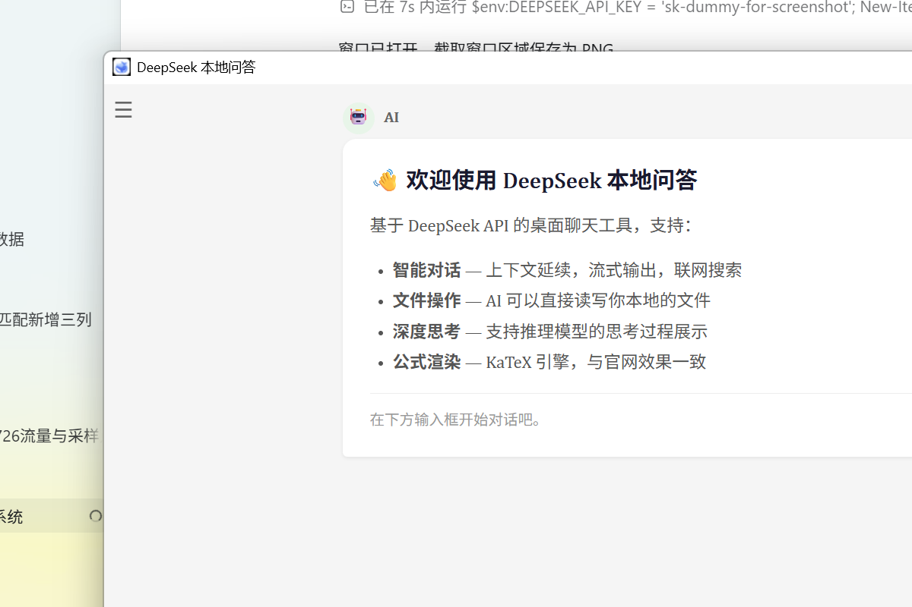

# DeepSeek 本地问答系统

> 一个轻盈、优雅的 DeepSeek 桌面客户端：流式输出、深度思考、文件操作、公式渲染，开箱即用。
>
> A lightweight desktop client for the DeepSeek API, powered by **pywebview + Flask + KaTeX**.


---

## ✨ 功能特性

### 智能对话
- **流式输出**：逐 token 实时显示，打字机效果
- **可中断生成**：回答过长时点击「停止」，立即节省 token，半截回复不落盘
- **深度思考展示**：支持 `deepseek-reasoner` / `deepseek-v4-flash` 的思考过程折叠面板
- **自动重试**：仅对服务器/网络错误（500/502/503/504/429）指数退避重试
- **联网搜索**：AI 可自动联网获取最新信息（需在 DeepSeek 平台开通搜索权限）
- **完成提示音**：回答结束后播放气泡音（Web Audio 合成，无需音频文件）

### 本地文件操作（Function Calling）
AI 在对话中可主动调用工具：

| 工具 | 功能 | 说明 |
|------|------|------|
| `read_file` | 读取文本 | 自动识别 UTF-8/GBK，超长内容自动截断 |
| `write_file` | 保存文件 | **统一保存到「总结」目录**，自动创建子目录 |
| `list_files` | 列出目录 | 文件与子目录按字母排序 |
| `get_file_info` | 查看信息 | 类型、大小、修改时间 |

点击右上角「总结」按钮可直接在资源管理器中打开文件保存目录。

### 公式与代码渲染
- **LaTeX 公式**：KaTeX 引擎，效果与 DeepSeek 官网一致
- **多层容错**：兼容单行/多行 `$$...$$`、`$...$`、`\(...\)`、`\[...\]` 及模型输出的双重反斜杠
- **代码高亮**：Pygments 语法着色，支持 70+ 编程语言
- **Markdown**：标题、表格、引用、列表完整支持
- **离线可用**：KaTeX 资源本地化，断网也能渲染历史记录

### 历史记录管理
- **自动保存**：每轮回答完成后落盘为 HTML（保留公式渲染）
- **覆盖更新**：同一会话只维护一个文件，不产生重复副本
- **智能命名**：根据首条消息自动生成文件名
- **继续对话**：加载历史后可在原上下文基础上继续提问

---

## 🖥 界面预览



---

## 🚀 快速开始

### 环境要求
- Windows 10/11（依赖 Edge WebView2，Win11 自带）
- Python 3.10+

### 1. 安装依赖

```bash
pip install -r requirements.txt
# 或安装为可执行命令：
pip install -e .
```

### 2. 配置 API Key

密钥通过**环境变量**或项目根目录的 **`.env`** 提供，代码中不保存任何密钥：

```bash
# 方式一：环境变量（PowerShell）
$env:DEEPSEEK_API_KEY = "sk-你的密钥"

# 方式二：.env 文件（推荐，已在 .gitignore 中排除）
copy .env.example .env
# 然后编辑 .env，填入真实密钥
```

> 密钥从 [platform.deepseek.com](https://platform.deepseek.com) 获取。

### 3. 启动

```bash
python main.py                 # 默认端口 5000
python main.py --port 5001     # 多开实例时指定端口
deepseek-client                # 使用 pip install -e . 安装后可直接运行
```

### Windows 一键启动

- 双击项目根目录的 **`启动.bat`**（用 `pythonw` 静默启动，无控制台窗口）
- 或创建桌面快捷方式指向 `pythonw.exe main.py`

---

## 📖 使用指南

### 基础对话
1. 底部输入框输入消息，`Enter` 发送，`Shift+Enter` 换行
2. AI 回复流式显示；推理模型的思考过程默认折叠，可点击展开
3. 回答过长可随时点击「停止」中断

### 历史记录
- 点击左上角 ☰ 打开历史侧栏
- 点击条目加载对话（可继续提问），悬停可 ✕ 删除
- 点击右上角「新对话」开始新话题

### 文件操作
直接告诉 AI 即可，例如：
- "读取 D:\data\report.txt"
- "帮我写一个 Python 脚本"（保存到总结目录）
- "列出当前目录下的文件"

---

## ⚙️ 配置说明

所有参数集中在 `config.py`（API Key 除外，见上文）。常用项：

| 参数 | 说明 | 默认值 |
|------|------|--------|
| `MODEL` | 模型名称 | `deepseek-v4-flash` |
| `SHOW_REASONING` | 是否展示思考过程 | `True` |
| `REASONING_EFFORT` | 推理强度（low/medium/high） | `medium` |
| `ENABLE_SEARCH` | 联网搜索 | `True` |
| `TEMPERATURE` | 温度 (0-2) | `0.7` |
| `MAX_TOKENS` | 单次回答最大 token | `40960` |
| `API_TIMEOUT` | 请求超时（秒） | `60` |
| `API_MAX_RETRIES` | 最大重试次数 | `3` |

完整参数见 [docs/API.md](docs/API.md)。

---

## 📁 项目结构

```
deepseek_client/
├── main.py                # 程序入口（含 --port 与 API Key 校验）
├── config.py              # 全局配置（版本号读取自 pyproject.toml）
├── pyproject.toml         # 项目元数据 & 依赖 & 命令行入口
├── requirements.txt       # 依赖清单
├── README.md / CHANGELOG.md / LICENSE
├── .env.example           # API Key 配置模板
│
├── core/                  # 核心逻辑层（不依赖任何 UI 代码）
│   ├── chat.py            # DeepSeek 会话管理：流式/工具循环/重试/取消
│   ├── tools.py           # Function Calling 文件工具集
│   ├── history.py         # 历史记录保存/加载/解析（HTML+TXT）
│   ├── html_renderer.py   # Markdown→HTML 渲染引擎（Pygments+KaTeX，多层容错）
│   └── prompts.py         # 系统提示词构建
│
├── ui/
│   └── webview_app.py     # 主界面：pywebview + Flask + SSE + 内联 HTML
│
├── static/katex/          # KaTeX 本地资源（断网可用）
├── tests/                 # 单元测试（unittest）
├── docs/                  # 架构设计 & API 参考
├── assets/                # 图标等静态素材
├── history/               # 对话记录（自动生成，已 gitignore）
└── 总结/                   # AI 生成文件的统一保存目录（自动创建，已 gitignore）
```

---

## 🛠 开发指南

### 运行测试

```bash
python -m unittest discover -s tests -v
```

GitHub Actions 会在 `main` 分支推送时自动在 Python 3.10/3.11/3.12 上运行测试。

### 添加新工具
1. 在 `core/tools.py` 中编写函数并注册到 `TOOLS`（OpenAI tool schema）与 `TOOL_MAP`
2. 工具会自动被 `ChatSession` 的 Function Calling 循环调用
3. 如需界面反馈，通过 `on_tool_call` 回调实现

### 添加新路由
1. 在 `ui/webview_app.py` 中用 `@app.route(...)` 定义
2. 前端 JS 在 `CHAT_HTML` 中通过 `fetch()` 调用

### 打包 exe

```bash
pip install pyinstaller
pyinstaller --onefile --windowed --name "DeepSeek问答" --icon icon.ico main.py
```

---

## ❓ 常见问题

- **端口被占用？** 程序会自动挑选空闲端口，无需手动处理。
- **公式显示异常？** 已内置多层容错（单行/多行公式、双反斜杠、下划线保护），如仍异常请提交 Issue 并附上原始回答。
- **离线还能用吗？** 历史记录渲染完全离线；联网仅用于 DeepSeek API 调用。
- **密钥安全吗？** API Key 只存于环境变量 / 本地 `.env`，不会进入 Git 历史。如曾泄露，请立即在 DeepSeek 平台吊销并更换。

---

## 📌 版本管理

- 版本号单一事实来源：`pyproject.toml` 的 `[project].version`，`config.py` 自动读取
- 遵循 [语义化版本](https://semver.org/lang/zh-CN/) 与 [Keep a Changelog](https://keepachangelog.com/zh-CN/1.1.0/)
- 变更历史见 [CHANGELOG.md](CHANGELOG.md)

## 📄 许可证

[MIT](LICENSE) © 2026 Rebelchen

## 🙏 致谢

- [DeepSeek](https://www.deepseek.com/) — 大模型 API
- [pywebview](https://pywebview.flowrl.com/) — 桌面窗口容器
- [KaTeX](https://katex.org/) — 公式渲染
- [Pygments](https://pygments.org/) — 代码高亮
